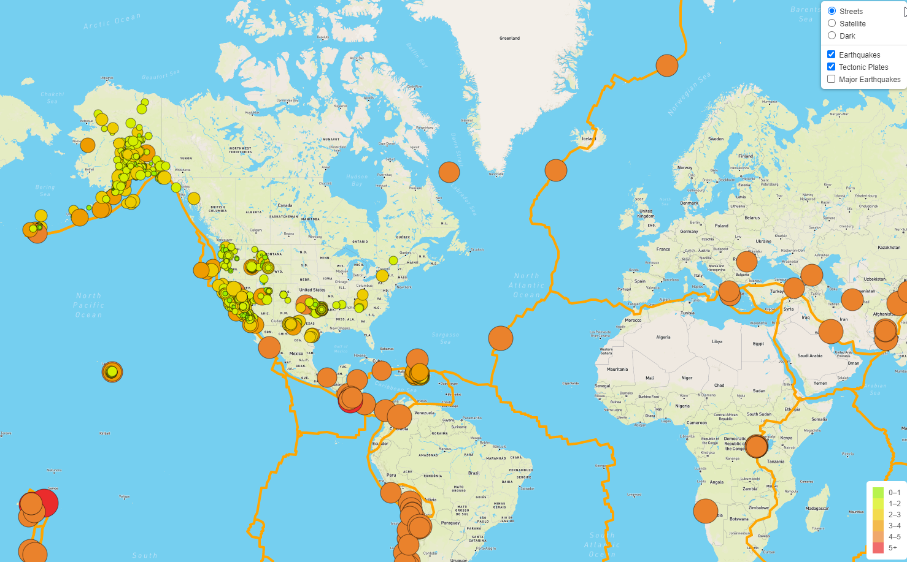
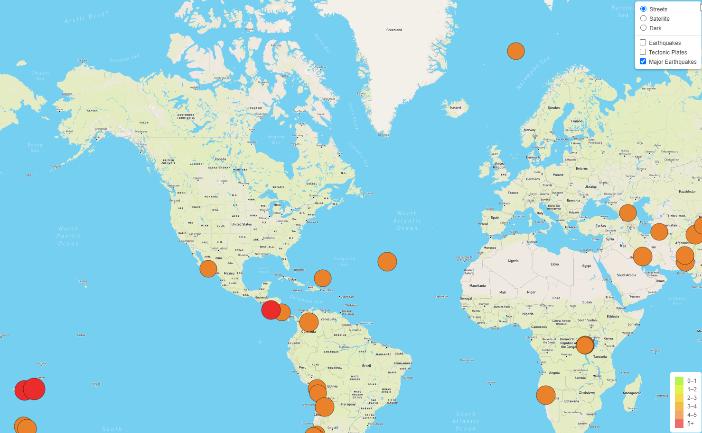
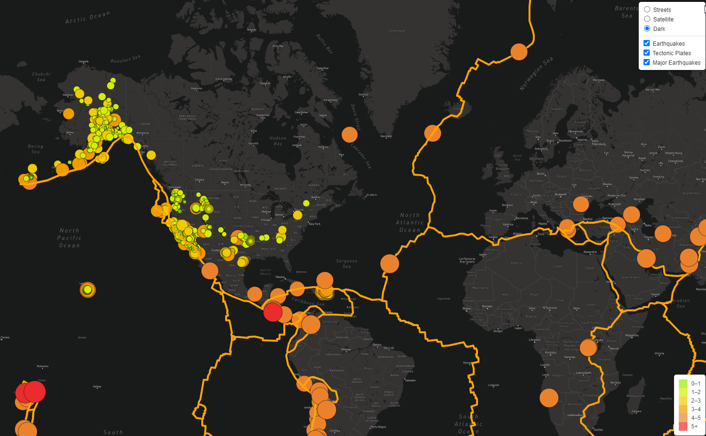

# Mapping Earthquakes

## Overview of Project

Basil and Sadhana like how you created your earthquake map with two different maps and the earthquake overlay. Now, Basil and Sadhana would like to see the earthquake data in relation to the tectonic plates’ location on the earth, and they would like to see all the earthquakes with a magnitude greater than 4.5 on the map, and they would like to see the data on a third map.

## Results

We added another layer outlining the tectonic plates to the map for deliverable 1:

We added another layer with only the major earthquakes for deliverable 2:

And we added the another map layer (dark) for deliverable 3:

